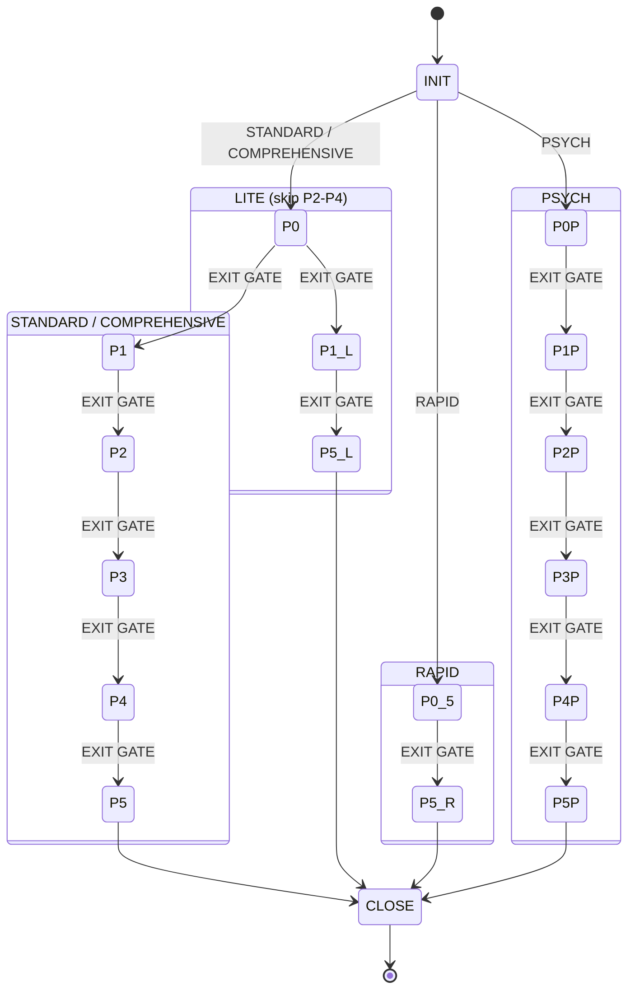

# Epistemic Deconstruction Protocol v6.7

## Core Objective

Transform epistemic uncertainty into predictive control through principled experimentation, compositional modeling, and Bayesian inference.

---

## Session Bootstrap (MANDATORY FIRST ACTION)

Run BEFORE any other tool calls. Do NOT batch with web fetches or file reads.

**Script location**: All Python scripts are in the skill directory at `<skill-dir>/scripts/`. Resolve `<skill-dir>` to the absolute path of this skill's installation (the directory containing this SKILL.md file).

**Session location**: The `--base-dir` flag controls where `analyses/` is created. It MUST point to the **user's project directory**, NOT the skill installation directory.

```bash
# <skill-dir> = absolute path to skill installation (directory containing SKILL.md)
# <project-dir> = user's working directory (where analyses/ should live)
# SM = shorthand used throughout this document
SM="python3 <skill-dir>/scripts/session_manager.py --base-dir <project-dir>"
$SM new "System description"
```

### Session File I/O (CRITICAL — Do NOT use Write/Read tools for session files)

Use `session_manager.py write` and `session_manager.py read` for ALL session file operations. These commands resolve absolute paths internally — you never need to construct file paths.

```bash
# WRITE a session file (content via heredoc):
$SM write state.md <<'EOF'
file content here
EOF

# READ a session file:
$SM read state.md

# READ for observations subdirectory:
$SM read observations/obs_001_topic.md

# GET absolute path (if needed for tracker --file flag):
$SM path hypotheses.json
```

**DO NOT use the Write tool or Read tool for session files.** They require absolute paths which cause errors. Use `session_manager.py write`/`read` via Bash instead.

See `references/session-memory.md` for full filesystem memory protocol.

---

## FSM: Protocol State Machine



**The analysis IS the session files. The session files are NOT overhead.**
Phase outputs, observations, and decisions are the primary work product.
The final report (`summary.md`) is written ONLY at Phase 5 or session close — it is a summary of work already done, not the work itself.

### Transition Rule

**No phase transition without passing the EXIT GATE.** Every phase has an EXIT GATE: a list of file writes that MUST be completed before advancing. If any write is missing, the phase is NOT complete. You may NOT proceed.

### File Write Matrix

R = must read before starting. W = must write before leaving. W? = write if applicable. — = don't touch. **Use `$SM read`/`$SM write` for all operations.**

| File | P0 | P0.5 | P1 | P2 | P3 | P4 | P5 |
|------|-----|------|-----|-----|-----|-----|-----|
| `state.md` | W | W | R+W | R+W | R+W | R+W | R+W |
| `analysis_plan.md` | W | R | R | R | — | — | R |
| `hypotheses.json` | W | — | R+W | R+W | R+W | R+W | R+W |
| `observations.md` | — | — | W | W | W | W? | R |
| `observations/` | — | — | W | W | W? | W? | R |
| `decisions.md` | W | W? | W? | W? | W? | W? | W? |
| `progress.md` | W | W | W | W | W | W | W |
| `phase_outputs/` | W | W | W | W | W | W | W |
| `validation.md` | — | — | — | — | — | — | W |
| `summary.md` | — | — | — | — | — | — | W |

### Gate Check Procedure

BEFORE moving from Phase N to Phase N+1, execute ALL steps using `$SM write`/`$SM read`:

1. `$SM write phase_outputs/phase_N.md <<'EOF' ... EOF` — phase deliverables
2. `$SM write state.md <<'EOF' ... EOF` — phase number, hypothesis count, lead hypothesis + posterior, confidence
3. `$SM write progress.md <<'EOF' ... EOF` — mark Phase N completed, set Phase N+1 in progress, list remaining
4. `$SM write decisions.md <<'EOF' ... EOF` — log analytical decisions (format: "X at the cost of Y")
5. Run `bayesian_tracker.py --file $($SM path hypotheses.json) report` and verify posteriors are current
6. End response with state block matching `state.md`

**CRITICAL**: Writing a monolithic analysis report outside Phase 5 is a protocol violation. Build evidence phase by phase. The report is Phase 5 output, not a shortcut.

---

## Evidence Rules (CRITICAL — Read Before First Hypothesis Update)

These rules prevent systematic evidence calibration errors:

1. **MAX LR = 5.0** per update during Phases 0-1. Phases 2+ may use up to LR=10 for direct experimental falsification. Any LR>5 requires justification logged in `decisions.md` (via `$SM write`).
2. **NO BATCH EVIDENCE**: Each distinct data point gets its own `bayesian_tracker.py update` call. Do NOT bundle "GDP + surplus + NPLs + tourism" into one LR=10 update.
3. **ADVERSARIAL HYPOTHESIS**: Maintain ≥1 hypothesis testing data reliability, institutional bias, or concealment. Non-negotiable.
4. **CONSENSUS ≠ STRONG EVIDENCE**: Forecaster/institutional consensus gets LR ≤ 2.5. Experts routinely miss turning points.
5. **DISCONFIRM BEFORE CONFIRM**: Before any hypothesis exceeds 0.80 posterior, you MUST have applied ≥1 disconfirming evidence to it.
6. **PRIOR DISCIPLINE**: For mutually exclusive hypotheses, priors MUST sum to 1.0 (±0.01). For non-exclusive hypotheses, document the overlap rationale in `decisions.md` (via `$SM write`).

```
WRONG: bayesian_tracker.py update H1 "GDP growth + fiscal surplus + NPLs + tourism" --preset strong_confirm
RIGHT: bayesian_tracker.py update H1 "EC projects 2.6% GDP growth 2026" --lr 2.0
       bayesian_tracker.py update H1 "Government surplus 3% GDP" --lr 1.5
       bayesian_tracker.py update H1 "NPL ratio 3.2%, below EU average" --lr 1.5
```

**Reference**: `references/evidence-calibration.md`

---

## State Block Protocol (REQUIRED)

**Every response during analysis MUST end with a State Block:**

```
[STATE: Phase X | Tier: Y | Active Hypotheses: N | Lead: HN (PP%) | Confidence: Low/Med/High]
```

Variants:
```
[STATE: Phase 0.5 | Tier: RAPID | Coherence: PASS | Red Flags: 2 | Verdict: SKEPTICAL]
[STATE: Phase 2-P | Tier: PSYCH | Archetype: High-N/Low-A | Rapport: Med | Stress: Low]
```

The state block MUST match what is written in `state.md`. If they diverge, run `$SM write state.md` to update.

---

## Auto-Pilot Mode

**"Help me start"** or **"Walk me through"** triggers questionnaire:

| # | System Analysis | PSYCH Analysis |
|---|----------------|----------------|
| 1 | What system? (software/hardware/org) | Subject type? (Real/Fictional/Online) |
| 2 | Access level? (source/binary/black-box) | Source material? (Text/Video/Mixed) |
| 3 | Adversary present? (yes/no/unknown) | Relationship? (Peer/Adversary/Observer) |
| 4 | Time budget? (hours) | Goal? (Predict/Detect/Negotiate/Rapport) |
| 5 | Goal? (how it works/parameters/vulns) | Time budget? (Brief/Extended/Ongoing) |

Map answers to tier → begin Phase 0.

---

## Tier Selection (REQUIRED FIRST STEP)

| Tier | Trigger | Phases | Budget |
|------|---------|--------|--------|
| **RAPID** | Quick claim validation | 0.5→5 | <30min |
| **LITE** | Known archetype, stable system | 0→1→5 | <2h |
| **STANDARD** | Unknown internals, single domain | 0→1→2→3→4→5 | 2-20h |
| **COMPREHENSIVE** | Multi-domain, adversarial, critical | All + decomposition | 20h+ |
| **PSYCH** | Human behavior analysis | 0-P→1-P→2-P→3-P→4-P→5-P | 1-4h |

Default: RAPID first. If unsure: STANDARD. Escalate to COMPREHENSIVE if >15 components or adversarial.

**Reference**: `references/decision-trees.md` (tier escalation, stopping criteria)

---

## Phase 0: Setup & Frame
*Budget: 10%*

**GATE IN**: Session created via `$SM new`. Verify `$SM read state.md` works.

**Activities:**
1. Define position (insider/outsider), access, constraints, system type
2. Build Question Pyramid (L1-L5: DO → HOW → WHY → PARAMETERS → REPLICATE)
3. Seed ≥3 hypotheses via `bayesian_tracker.py --file $($SM path hypotheses.json) add` (H1: likely, H2: alternative, H3: adversarial/deceptive)
4. Adversarial pre-check (high entropy? anti-debug? information asymmetry?)
5. Acknowledge cognitive vulnerabilities (see `references/cognitive-traps.md`)

**Fidelity Levels:**
| Level | Question | Goal | Test |
|-------|----------|------|------|
| L1 | DO | Trigger a response? | Any output from input |
| L2 | HOW | What transforms I→O? | Explain processing steps |
| L3 | WHY | What drives mechanism? | Predict design choices |
| L4 | PARAMETERS | What values control it? | <5% error on measurables |
| L5 | REPLICATE | Can I rebuild it? | Replica indistinguishable |

**EXIT GATE — write each via `$SM write <filename>`:**
- [ ] `analysis_plan.md`: ALL fields filled (system, access, adversary, tier, fidelity, pyramid, hypotheses, pre-check, cognitive traps). No placeholder text.
- [ ] `hypotheses.json`: ≥3 hypotheses via CLI, including ≥1 adversarial
- [ ] `decisions.md`: tier selection logged with trade-off rationale
- [ ] `state.md`: updated (phase=0 complete, tier, fidelity, hypothesis count, lead H)
- [ ] `progress.md`: Phase 0 complete, remaining phases listed
- [ ] `phase_outputs/phase_0.md`: setup deliverables written

**Reference**: `references/setup-techniques.md`, `references/cognitive-traps.md`

---

## Phase 0.5: Coherence Screening (RAPID Entry)
*Budget: 5-10%*

**GATE IN**: `$SM read state.md`, review claim or system description

**Activities:**
1. Claim-task alignment (data matches task? metrics appropriate?)
2. Instant reject conditions (impossibility, contamination, incoherence)
3. Red flag scan (missing baseline? tool worship? documentation gaps?)
4. Domain calibration check

| Result | Criteria | Action |
|--------|----------|--------|
| **GO** | 0 rejects, <3 flags, coherent | Proceed |
| **CONDITIONAL** | Minor concerns | Request info |
| **NO-GO** | Reject condition OR 3+ flags | REJECT |

**EXIT GATE — write each via `$SM write <filename>`:**
- [ ] `state.md`: updated with verdict
- [ ] `progress.md`: Phase 0.5 checked off
- [ ] `phase_outputs/phase_0_5.md`: coherence report written
- [ ] If REJECT: analysis stops. If escalating tier: log in `decisions.md`

**Reference**: `references/rapid-assessment.md`, `references/coherence-checks.md`, `references/red-flags.md`, `references/domain-calibration.md`

---

## Phase 1: Boundary Mapping
*Budget: 20%*

**GATE IN**: `$SM read state.md`, `$SM read analysis_plan.md`, `$SM read hypotheses.json`

**Activities:**
1. Enumerate I/O channels (explicit, implicit, side-channel, feedback)
2. Apply probe signals (step, impulse, PRBS, edge cases)
3. Assess data quality (coherence γ² ≈ 1.0 = good)
4. Build stimulus-response database
5. Write each finding via `$SM write observations/obs_NNN_topic.md`
6. Update `observations.md` via `$SM write observations.md` after every 2 findings
7. Update hypotheses via `bayesian_tracker.py update --file $($SM path hypotheses.json)` — one update per data point

**EXIT GATE — write each via `$SM write <filename>`:**
- [ ] `observations/`: ≥3 observation files (LITE: ≥1)
- [ ] `observations.md`: index updated with all files
- [ ] `hypotheses.json`: evidence applied (≥1 update per active hypothesis)
- [ ] ≥80% I/O channels characterized; stimulus-response database ≥20 entries (LITE: ≥5)
- [ ] `state.md` updated | `progress.md` updated | `phase_outputs/phase_1.md` written

**Reference**: `references/boundary-probing.md`

---

## Phase 2: Causal Analysis
*Budget: 25%*

**GATE IN**: `$SM read state.md`, `$SM read observations.md`, `$SM read hypotheses.json`, `$SM read decisions.md`

**Activities:**
1. Static analysis (if visible): disassembly, decompilation, data flow
2. Dynamic analysis: tracer injection, differential analysis
3. Sensitivity analysis (Morris screening, Sobol' indices)
4. Construct causal graph (nodes, edges, feedback loops R/B)
5. Falsification loop: for each H, design test to break it, run, update tracker
6. Write new findings via `$SM write observations/...`; log causal model decisions via `$SM write decisions.md`

**EXIT GATE — write each via `$SM write <filename>`:**
- [ ] ≥70% behaviors have causal explanation
- [ ] ≥1 hypothesis refuted or significantly weakened
- [ ] `observations/` and `observations.md` updated with causal findings
- [ ] `hypotheses.json`: falsification evidence applied
- [ ] `decisions.md`: causal model choices logged
- [ ] `state.md` updated | `progress.md` updated | `phase_outputs/phase_2.md` written

**Reference**: `references/causal-techniques.md`, `references/tools-sensitivity.md`

---

## Phase 3: Parametric Identification
*Budget: 20%*

**GATE IN**: `$SM read state.md`, `$SM read phase_outputs/phase_2.md`, `$SM read hypotheses.json`

**Activities:**
1. Select model structure (ARX → ARMAX → NARMAX → State-Space)
2. Estimate parameters (OLS, subspace methods); apply AIC/BIC for structure selection
3. Quantify uncertainty (bootstrap, Bayesian)
4. For time-series: run `scripts/ts_reviewer.py` diagnostics; use `compare_models()`, `walk_forward_split()` for temporal CV
5. Update hypotheses with model-derived evidence

**EXIT GATE — write each via `$SM write <filename>`:**
- [ ] Model selected via information criterion; parameters documented with uncertainty bounds
- [ ] Residuals pass whiteness test (if applicable)
- [ ] Cross-validation R² > 0.8 (walk-forward); FVA > 0% for time-series
- [ ] `hypotheses.json` updated | `decisions.md` updated (model choice + trade-off)
- [ ] `state.md` updated | `progress.md` updated | `phase_outputs/phase_3.md` written

**Reference**: `references/system-identification.md`, `references/timeseries-review.md`, `references/forecasting-science.md`, `references/financial-validation.md`

---

## Phase 4: Model Synthesis
*Budget: 15%*

**GATE IN**: `$SM read state.md`, `$SM read phase_outputs/phase_3.md`, `$SM read phase_outputs/phase_1.md`

**Activities:**
1. Compose sub-models (serial H₁·H₂, parallel H₁+H₂, feedback G/(1+GH))
2. Propagate uncertainty through composition
3. Test for emergence: `mismatch = |predicted - actual| / |actual|`; if > 20%, emergence present
4. Classify archetype (see `references/simulation-guide.md` archetype table)
5. Run simulation if applicable: `scripts/simulator.py`

**EXIT GATE — write each via `$SM write <filename>`:**
- [ ] All sub-models composed with explicit semantics; uncertainty propagated
- [ ] Emergence test performed and documented
- [ ] Archetype identified with vulnerability assessment
- [ ] `hypotheses.json` updated | `observations.md` updated if simulation produced findings
- [ ] `state.md` updated | `progress.md` updated | `phase_outputs/phase_4.md` written

**Reference**: `references/compositional-synthesis.md`, `references/simulation-guide.md`

---

## Phase 5: Validation & Report
*Budget: 10%*

**GATE IN**: `$SM read state.md`, `$SM read` all `phase_outputs/`, `$SM read observations.md`, `$SM read hypotheses.json`

**Activities:**
1. Validation hierarchy (interpolation R²>0.95, extrapolation R²>0.80, counterfactual)
2. Residual diagnostics: `ts_reviewer.py` phases 7-10 (if applicable)
3. Baseline comparison: FVA > 0% required for time-series
4. Domain calibration against plausibility bounds
5. Uncertainty quantification: `conformal_intervals()` or `cqr_intervals()`
6. If simulator ran: `scripts/simulator.py bridge` to validate predictions
7. Adversarial posture classification (if applicable)
8. **`$SM write summary.md`** — the final analysis report. This references observations, cites evidence trail, includes the state block. This is the ONLY phase where a report is produced.

**EXIT GATE — write each via `$SM write <filename>`:**
- [ ] `validation.md`: fully populated (validation hierarchy table, verdict)
- [ ] `summary.md`: final report written, references session files, includes state block
- [ ] `hypotheses.json`: final posteriors recorded
- [ ] `state.md`: Phase 5 complete, final confidence
- [ ] `progress.md`: all phases marked complete
- [ ] `phase_outputs/phase_5.md` written

**Reference**: `references/validation-checklist.md`, `references/adversarial-heuristics.md`, `references/timeseries-review.md`

---

## PSYCH Tier: Psychological Profiling

For analyzing human behavior, personas, and profiles. See `references/psych-tier-protocol.md` for complete protocol.

**Phases:** 0-P (Context) → 1-P (Baseline) → 2-P (Stimulus-Response) → 3-P (Structural ID) → 4-P (Motive) → 5-P (Validation)

**Same FSM rules apply**: EXIT GATE must be passed at each phase. File writes are mandatory. Use `scripts/belief_tracker.py` instead of `bayesian_tracker.py`.

**Ethical Constraints**: No clinical diagnosis. Cultural calibration required. Document consent. Defensive use only.

**Key Outputs:** OCEAN profile, Dark Triad assessment, MICE/RASP driver ranking, behavioral predictions, interaction strategy.

**State Block:** `[STATE: Phase X-P | Tier: PSYCH | Archetype: Y | Rapport: L/M/H | Stress: L/M/H]`

**Reference**: `references/psych-tier-protocol.md`, `references/archetype-mapping.md`, `references/motive-analysis.md`

---

## Bayesian Tracking

Update rule: `P(H|E) = LR · P(H) / [LR · P(H) + (1 - P(H))]`

| Evidence Strength | LR Range | Approx Effect |
|-------------------|----------|---------------|
| Strong confirm | 3.0–5.0 | posterior ≈ prior × 2–3 |
| Moderate confirm | 1.5–3.0 | posterior ≈ prior × 1.3–2 |
| Weak confirm | 1.1–1.5 | posterior ≈ prior × 1.05–1.3 |
| Neutral | 1.0 | no change |
| Weak disconfirm | 0.5–0.9 | posterior × 0.7–0.95 |
| Moderate disconfirm | 0.2–0.5 | posterior × 0.3–0.7 |
| Strong disconfirm | 0.05–0.2 | posterior × 0.1–0.3 |

Bayes Factor (model comparison): K = P(D|M₁)/P(D|M₂) — log₁₀(K) > 2 decisive, > 1 strong.

**Tools**: `scripts/bayesian_tracker.py` | `scripts/belief_tracker.py` | `scripts/rapid_checker.py`
Full CLI reference in CLAUDE.md. Presets: strong_confirm, moderate_confirm, weak_confirm, neutral, weak_disconfirm, moderate_disconfirm, strong_disconfirm, falsify.

**Reference**: `references/evidence-calibration.md`

---

## Decision Trees

### "Which Model Structure?"
```
├─ Single output?
│  ├─ Linear? → ARX (ARMAX if colored noise)
│  └─ Nonlinear? → NARMAX
└─ Multiple outputs? → State-Space
   Discrete modes? → EFSM
```

### "When to Stop?"
```
├─ Time budget exhausted? → STOP, document uncertainty
├─ Fidelity target met? → STOP, deliver model
├─ Diminishing returns (<5%/hr)? → STOP or escalate tier
└─ Adversarial detection? → Pause, reassess
```

### "RAPID → Next Tier?"
```
├─ CREDIBLE + no follow-up? → DONE
├─ SKEPTICAL/DOUBTFUL + need more? → STANDARD
├─ REJECT + must investigate? → STANDARD (root cause)
└─ Complex system revealed? → COMPREHENSIVE
```

**Reference**: `references/decision-trees.md` (full set including recursive decomposition)

---

## Critical Reminders

- **Falsify, don't confirm**: Design tests to break hypotheses.
- **Quantify uncertainty**: Never report point estimates alone.
- **Emergence is real**: Component models ≠ system model.
- **Map ≠ Territory**: Your model is wrong. Document HOW it's wrong.
- **Know your traps**: See `references/cognitive-traps.md`.
- **Files are truth**: If it's not written to a session file, it didn't happen.
- **Use `$SM write`/`$SM read`**: Never use Write/Read tools for session files. Session manager handles paths.
- **No reports before Phase 5**: Build evidence phase by phase.
- **Gate checks are non-negotiable**: Every phase transition requires disk writes.
- **Web search resilience**: Never batch WebFetch to untested domains with other tool calls. If WebFetch fails (403/timeout), try `WebSearch` with `site:domain query` as fallback.
- **Tool selection**: See `references/tool-catalog.md` for recommendations by phase and domain.
