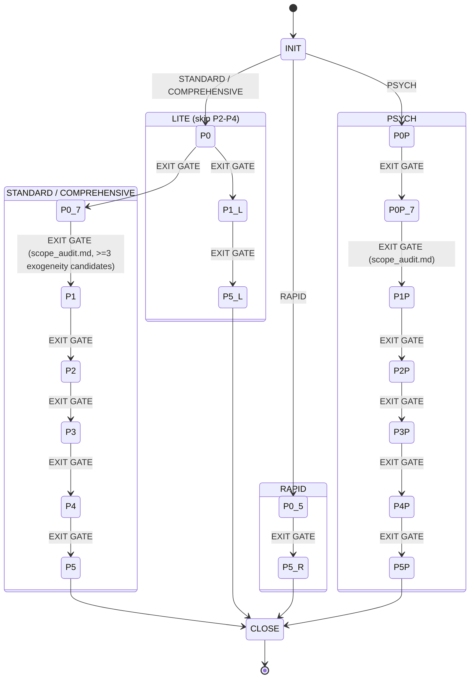

# Epistemic Deconstruction Protocol v7.13.0

## Core Objective

Transform epistemic uncertainty into predictive control through principled experimentation, compositional modeling, and Bayesian inference.

---

## Session Bootstrap (MANDATORY FIRST ACTION)

Run BEFORE any other tool calls. Do NOT batch with web fetches or file reads.

**Script location**: All Python scripts are in the skill directory at `<skill-dir>/scripts/`. Resolve `<skill-dir>` to the absolute path of this skill's installation (the directory containing this SKILL.md file).

**Session location**: The `--base-dir` flag controls where `analyses/` is created. It MUST point to the **user's project directory**, NOT the skill installation directory.

```bash
# <skill-dir> = absolute path to skill installation (directory containing SKILL.md)
# <project-dir> = user's working directory (where analyses/ should live)
# SM = shorthand used throughout this document
# CRITICAL: Shell variables do NOT persist between Bash tool calls.
# You MUST redefine SM at the start of EVERY Bash call, e.g.:
#   SM="..." && $SM read state.md
SM="python3 <skill-dir>/scripts/session_manager.py --base-dir <project-dir>"
$SM new "System description"
```

### Session File I/O (CRITICAL — Do NOT use Write/Read tools for session files)

Use `session_manager.py write` and `session_manager.py read` for ALL session file operations. These commands resolve absolute paths internally — you never need to construct file paths.

```bash
# IMPORTANT: Redefine SM at the start of every Bash call (shell state doesn't persist).

# WRITE a session file (content via heredoc):
SM="python3 <skill-dir>/scripts/session_manager.py --base-dir <project-dir>" && $SM write state.md <<'EOF'
file content here
EOF

# READ a session file:
SM="..." && $SM read state.md

# GET absolute path (for tracker --file flag):
SM="..." && $SM path hypotheses.json

# TRACKER with session file:
SM="..." && python3 <skill-dir>/scripts/bayesian_tracker.py --file $($SM path hypotheses.json) add "Hypothesis" --prior 0.6
```

**DO NOT use the Write/Read tools for session files.** Redefine SM in every Bash call — shell variables reset between calls. See `references/session-memory.md`.

---

## FSM: Protocol State Machine


```mermaid
stateDiagram-v2
    [*] --> INIT
    INIT --> P0 : STANDARD / COMPREHENSIVE
    INIT --> P0_5 : RAPID
    INIT --> P0P : PSYCH

    state "STANDARD / COMPREHENSIVE" as std {
        P0 --> P0_7 : EXIT GATE
        P0_7 --> P1 : EXIT GATE (scope_audit.md, >=3 exogeneity candidates)
        P1 --> P2 : EXIT GATE
        P2 --> P3 : EXIT GATE
        P3 --> P4 : EXIT GATE
        P4 --> P5 : EXIT GATE
    }

    state "LITE (skip P2-P4)" as lite {
        P0 --> P1_L : EXIT GATE
        P1_L --> P5_L : EXIT GATE
    }

    state "RAPID" as rapid {
        P0_5 --> P5_R : EXIT GATE
    }

    state "PSYCH" as psych {
        P0P --> P0P_7 : EXIT GATE
        P0P_7 --> P1P : EXIT GATE (scope_audit.md)
        P1P --> P2P : EXIT GATE
        P2P --> P3P : EXIT GATE
        P3P --> P4P : EXIT GATE
        P4P --> P5P : EXIT GATE
    }

    P5 --> CLOSE
    P5_L --> CLOSE
    P5_R --> CLOSE
    P5P --> CLOSE
    CLOSE --> [*]
```

**The session files ARE the analysis.** `summary.md` (Phase 5 only) summarizes prior work, not the work itself.

### Transition Rules

**No phase transition without passing the EXIT GATE.** If any required write is missing, the phase is NOT complete.

**Multi-pass**: `$SM reopen <phase> "reason"` reopens any completed phase (max 3 reopens). Archives output as `phase_N_passK.md`. Evidence carries forward — don't replay old updates. See `references/multi-pass-protocol.md`.

### File Write Matrix

R = must read before starting. W = must write before leaving. W? = write if applicable. — = don't touch. **Use `$SM read`/`$SM write` for all operations.**

| File | P0 | P0.5 | P0.7 | P1 | P2 | P3 | P4 | P5 |
|------|-----|------|------|-----|-----|-----|-----|-----|
| `state.md` | W | W | R+W | R+W | R+W | R+W | R+W | R+W |
| `analysis_plan.md` | W | — | R+W | R | R | — | — | R |
| `hypotheses.json` | W | — | R+W | R+W | R+W | R+W | R+W | R+W |
| `rapid_assessment.json` | — | W | — | — | — | — | — | R |
| `scope_audit.md` | — | — | W | R | R | R | R | R |
| `scope_audit.json` | — | — | R+W | R | R | R+W | R | R+W |
| `observations.md` | — | — | — | W | W | W | W? | R |
| `observations/` | — | — | — | W | W | W? | W? | R |
| `decisions.md` | W | W? | W? | W? | W? | W? | W? | W? |
| `progress.md` | W | W | W | W | W | W | W | W |
| `phase_outputs/` | W | W | W | W | W | W | W | W |
| `validation.md` | — | — | — | — | — | — | — | W |
| `summary.md` | — | — | — | — | — | — | — | W |

### Gate Check Procedure

BEFORE moving from Phase N to Phase N+1, execute ALL steps using `$SM write`/`$SM read`:

1. `$SM write phase_outputs/phase_N.md <<'EOF' ... EOF` — phase deliverables
2. `$SM write state.md <<'EOF' ... EOF` — phase number, hypothesis count, lead hypothesis + posterior, confidence
3. `$SM write progress.md <<'EOF' ... EOF` — mark Phase N completed, set Phase N+1 in progress, list remaining
4. `$SM write decisions.md <<'EOF' ... EOF` — log analytical decisions (format: "X at the cost of Y")
5. Run `bayesian_tracker.py --file $($SM path hypotheses.json) report` and verify posteriors are current
6. **Multi-pass eval**: Check triggers in `references/multi-pass-protocol.md` — if any fire, `$SM reopen` instead of advancing
7. End response with state block matching `state.md`

**CRITICAL**: No monolithic reports outside Phase 5. Build evidence phase by phase.

---

## Evidence Rules (CRITICAL — Read Before First Hypothesis Update)

These rules prevent systematic evidence calibration errors:

1. **MAX LR = 3.0** during Phase 0; **MAX LR = 5.0** during Phase 1. Phases 2+ may use up to LR=10 for direct experimental falsification. Any LR>5 requires justification logged in `decisions.md` (via `$SM write`).
2. **NO BATCH EVIDENCE**: Each distinct data point gets its own `bayesian_tracker.py update` call. Do NOT bundle "GDP + surplus + NPLs + tourism" into one LR=10 update.
3. **ADVERSARIAL HYPOTHESIS**: Maintain ≥1 hypothesis testing data reliability, institutional bias, or concealment. Non-negotiable.
4. **CONSENSUS ≠ STRONG EVIDENCE**: Forecaster/institutional consensus gets LR ≤ 2.5. Experts routinely miss turning points.
5. **DISCONFIRM BEFORE CONFIRM**: Before any hypothesis exceeds 0.80 posterior, you MUST have applied ≥1 disconfirming evidence to it.
6. **PRIOR DISCIPLINE**: For mutually exclusive hypotheses, priors MUST sum to 1.0 (±0.01). For non-exclusive hypotheses, document the overlap rationale in `decisions.md` (via `$SM write`).
7. **SCOPE HYPOTHESIS STANDING PAIR** (STANDARD/COMPREHENSIVE/PSYCH only): Phase 0 MUST seed two standing hypotheses alongside H1..HN, using canonical statement prefixes `[H_S]` ("drivers live within initial scope S") and `[H_S_prime]` ("material drivers exist outside S"). Both are tracked for the entire session. `[H_S_prime]` satisfies the ≥1 adversarial hypothesis requirement. At Phase 5, validation fails if `[H_S_prime]` posterior > 0.40 unless a scope-expansion multi-pass (trigger S1) has been completed. See `references/scope-interrogation.md`.

```
WRONG: bayesian_tracker.py update H1 "GDP growth + fiscal surplus + NPLs + tourism" --preset strong_confirm
RIGHT: bayesian_tracker.py update H1 "EC projects 2.6% GDP growth 2026" --lr 2.0
       bayesian_tracker.py update H1 "Government surplus 3% GDP" --lr 1.5
       bayesian_tracker.py update H1 "NPL ratio 3.2%, below EU average" --lr 1.5
```

**Reference**: `references/evidence-calibration.md`

---

## State Block Protocol (REQUIRED)

**Every response during analysis MUST end with a State Block:**

```
[STATE: Phase X | Tier: Y | Active Hypotheses: N | Lead: HN (PP%) | Confidence: Low/Med/High]
```

Variants:
```
[STATE: Phase 0.5 | Tier: RAPID | Coherence: PASS | Red Flags: 2 | Verdict: SKEPTICAL]
[STATE: Phase 2-P | Tier: PSYCH | Archetype: High-N/Low-A | Rapport: Med | Stress: Low]
```

The state block MUST match what is written in `state.md`. If they diverge, run `$SM write state.md` to update.

---

## Auto-Pilot Mode

**"Help me start"** or **"Walk me through"** triggers questionnaire:

| # | System Analysis | PSYCH Analysis |
|---|----------------|----------------|
| 1 | What system? (software/hardware/org) | Subject type? (Real/Fictional/Online) |
| 2 | Access level? (source/binary/black-box) | Source material? (Text/Video/Mixed) |
| 3 | Adversary present? (yes/no/unknown) | Relationship? (Peer/Adversary/Observer) |
| 4 | Goal? (how it works/parameters/vulns) | Goal? (Predict/Detect/Negotiate/Rapport) |

Map answers to tier → begin Phase 0.

---

## Tier Selection (REQUIRED FIRST STEP)

| Tier | Trigger | Phases |
|------|---------|--------|
| **RAPID** | Quick claim validation | 0.5→5 |
| **LITE** | Known archetype, stable system | 0→1→5 |
| **STANDARD** | Unknown internals, single domain | 0→1→2→3→4→5 |
| **COMPREHENSIVE** | Multi-domain, adversarial, critical | All + decomposition |
| **PSYCH** | Human behavior analysis | 0-P→1-P→2-P→3-P→4-P→5-P |

Default: RAPID first. If unsure: STANDARD. Escalate to COMPREHENSIVE if >15 components or adversarial.

**Reference**: `references/decision-trees.md` (tier escalation, stopping criteria)

---

## Phase 0: Setup & Frame

**GATE IN**: Session created via `$SM new`. Verify `$SM read state.md` works.

**Activities:**
1. Define position (insider/outsider), access, constraints, system type
2. Build Question Pyramid (L1-L5: DO → HOW → WHY → PARAMETERS → REPLICATE)
3. Seed ≥3 hypotheses via `bayesian_tracker.py --file $($SM path hypotheses.json) add` (H1: likely, H2: alternative, H3: adversarial/deceptive)
4. **Seed the H_S standing pair** (STANDARD/COMPREHENSIVE/PSYCH): add `"[H_S] Drivers of <target> live within initial scope <S>"` and `"[H_S_prime] Material drivers exist outside <S>"` via `bayesian_tracker.py add`. `[H_S_prime]` satisfies rule 3's adversarial requirement.
5. Adversarial pre-check (high entropy? anti-debug? information asymmetry?)
6. Acknowledge cognitive vulnerabilities (see `references/cognitive-traps.md` — pay attention to Trap 20 Framing, Trap 23 Premature Closure)

**Fidelity Levels:**
| Level | Question | Goal | Test |
|-------|----------|------|------|
| L1 | DO | Trigger a response? | Any output from input |
| L2 | HOW | What transforms I→O? | Explain processing steps |
| L3 | WHY | What drives mechanism? | Predict design choices |
| L4 | PARAMETERS | What values control it? | <5% error on measurables |
| L5 | REPLICATE | Can I rebuild it? | Replica indistinguishable |

**EXIT GATE — write each via `$SM write <filename>`:**
- [ ] `analysis_plan.md`: ALL fields filled (system, access, adversary, tier, fidelity, pyramid, hypotheses, pre-check, cognitive traps, scope S definition). No placeholder text. LITE: may omit adversarial pre-check if no adversary indicated.
- [ ] `hypotheses.json`: ≥3 hypotheses via CLI, including ≥1 adversarial. STANDARD/COMPREHENSIVE/PSYCH MUST also contain `[H_S]` and `[H_S_prime]` statements (grep-verifiable via `bayesian_tracker.py report | grep "\[H_S"`)
- [ ] `decisions.md`: tier selection logged with trade-off rationale
- [ ] `state.md`: updated (phase=0 complete, tier, fidelity, hypothesis count, lead H)
- [ ] `progress.md`: Phase 0 complete, remaining phases listed
- [ ] `phase_outputs/phase_0.md`: setup deliverables written

**Reference**: `references/setup-techniques.md`, `references/cognitive-traps.md`, `references/scope-interrogation.md` (H_S standing pair), `references/modeling-epistemology.md` (foundational reasoning principles)

---

## Phase 0.5: Coherence Screening (RAPID Entry)

**GATE IN**: `$SM read state.md`, review claim or system description

**Activities:**
1. Claim-task alignment (data matches task? metrics appropriate?)
2. Instant reject conditions (impossibility, contamination, incoherence)
3. Red flag scan (missing baseline? tool worship? documentation gaps?)
4. Domain calibration check

| Verdict | Criteria | Action |
|---------|----------|--------|
| **CREDIBLE** | 0 rejects, 0-1 flags, coherent | DONE (or proceed to full analysis) |
| **SKEPTICAL** | 2+ flags, minor concerns | Request info or escalate to STANDARD |
| **DOUBTFUL** | 4+ flags or 3+ categories | Escalate to STANDARD with caution |
| **REJECT** | Reject condition OR critical flags | Analysis stops; log rationale |

**EXIT GATE — write each via `$SM write <filename>`:**
- [ ] `state.md`: updated with verdict
- [ ] `progress.md`: Phase 0.5 checked off
- [ ] `phase_outputs/phase_0_5.md`: coherence report written
- [ ] If REJECT: analysis stops. If escalating tier: log in `decisions.md`

**Reference**: `references/rapid-assessment.md`, `references/coherence-checks.md`, `references/red-flags.md`, `references/domain-calibration.md`

---

## Phase 0.7: Scope Interrogation (STANDARD / COMPREHENSIVE / PSYCH)

**Runs after Phase 0, before Phase 1.** Purpose: promote the system boundary from a premise to a hypothesis. Surface drivers that live outside the initially-framed scope S so they enter the analysis as hypotheses in the FIRST pass, not after re-runs. **Skipped in RAPID and LITE tiers.**

**GATE IN**: `$SM read state.md`, `$SM read analysis_plan.md`, `$SM read hypotheses.json`. Confirm `[H_S]` and `[H_S_prime]` are already seeded from Phase 0.

**Activities:**
1. Start a scope audit session: `python3 <skill-dir>/scripts/scope_auditor.py --file $($SM path scope_audit.json) start "<target>"`
2. **M1 Flow Tracing**: enumerate input and output channels from `analysis_plan.md`. For each, name the immediate upstream generator (inputs) or downstream consumer (outputs). Any neighbor outside scope S → exogeneity candidate.
   `scope_auditor.py trace --inputs "c1,c2" --outputs "c3,c4" --file $($SM path scope_audit.json)`
3. **M2 Archetype Accomplices**: classify the target into 1-3 archetypes from `references/archetype-accomplices.md`. For each, enumerate the accomplice library:
   `scope_auditor.py enumerate --archetype <id> --file $($SM path scope_audit.json)`
4. **M3 Residual-Signature Matching** (deferred if no baseline model exists yet): if a preliminary model is available, compare residuals against external indices:
   `scope_auditor.py residual-match --residuals residuals.csv --indices-dir ./indices/ --file $($SM path scope_audit.json)`
5. **M4 Adversarial Scoping (Steelman)**: produce three critiques from distinct personas — domain outsider, investigative journalist, regulator. Each must name one excluded domain AND one mechanism. Log each:
   `scope_auditor.py steelman --persona outsider|journalist|regulator --domain "..." --mechanism "..." --file $($SM path scope_audit.json)`
6. Dedupe candidates: `scope_auditor.py dedupe --file $($SM path scope_audit.json)`
7. Check the Phase 0.7 gate: `scope_auditor.py gate --file $($SM path scope_audit.json)` — must pass (≥3 unique candidates, ≥1 archetype query, ≥1 flow trace).
8. For each final candidate, seed an exogeneity hypothesis in `hypotheses.json` via `bayesian_tracker.py add` with the suggested prior. Use a distinctive statement prefix like `[H_SCOPE_<domain>]` for traceability.
9. Write `scope_audit.md` via `$SM write scope_audit.md` — human-readable summary of M1-M4 outputs and the final candidate list. Use `scope_auditor.py report --verbose` as the body.

**EXIT GATE — write each via `$SM write <filename>`:**
- [ ] `scope_audit.md`: written with all four mechanism outputs (M1, M2, M3 or "deferred", M4)
- [ ] `scope_audit.json`: persisted, `scope_auditor.py gate` returns PASS (≥3 unique candidates)
- [ ] `hypotheses.json`: exogeneity candidates seeded as additional hypotheses with priors ≥ 0.05
- [ ] `analysis_plan.md`: updated scope S (if expanded) and cross-references to new hypotheses
- [ ] `decisions.md`: log scope-expansion decisions with trade-off (what was added, at the cost of what depth elsewhere)
- [ ] `state.md`: updated (Phase 0.7 complete)
- [ ] `progress.md`: updated
- [ ] `phase_outputs/phase_0_7.md`: summary written

**CRITICAL**: "None found" is NOT a valid Phase 0.7 output. If you cannot produce 3 unique candidates, the archetype classification (M2) or steelman procedure (M4) was too shallow — rerun with a different archetype or different persona lens. The PSYCH tier uses the same protocol but frames S as "which life domains inform the subject's behavior."

**Reference**: `references/scope-interrogation.md` (full protocol + worked examples), `references/archetype-accomplices.md` (library), `references/cognitive-traps.md` Traps 20-23 (Framing, Streetlight, OVB, Premature Closure)

---

## Phase 1: Boundary Mapping

**GATE IN**: `$SM read state.md`, `$SM read analysis_plan.md`, `$SM read hypotheses.json`

**Activities:**
1. Enumerate I/O channels (explicit, implicit, side-channel, feedback)
2. Apply probe signals (step, impulse, PRBS, edge cases)
3. Assess data quality (coherence γ² ≈ 1.0 = good)
4. Build stimulus-response database
5. Write each finding via `$SM write observations/obs_NNN_topic.md`
6. Update `observations.md` via `$SM write observations.md` after every 2 findings
7. Update hypotheses via `bayesian_tracker.py update --file $($SM path hypotheses.json)` — one update per data point

**EXIT GATE — write each via `$SM write <filename>`:**
- [ ] `observations/`: ≥3 observation files (LITE: ≥1)
- [ ] `observations.md`: index updated with all files
- [ ] `hypotheses.json`: evidence applied (≥1 update per active hypothesis)
- [ ] ≥80% I/O channels characterized; stimulus-response database ≥20 entries (LITE: ≥5)
- [ ] `state.md` updated | `progress.md` updated | `phase_outputs/phase_1.md` written

**Reference**: `references/boundary-probing.md`, `references/spectral-analysis.md` (frequency-domain profiling via `fourier_analyst.py`)

---

## Phase 2: Causal Analysis

**GATE IN**: `$SM read state.md`, `$SM read observations.md`, `$SM read hypotheses.json`, `$SM read decisions.md`

**Activities:**
1. Static analysis (if visible): disassembly, decompilation, data flow
2. Dynamic analysis: tracer injection, differential analysis
3. Sensitivity analysis (Morris screening, Sobol' indices)
4. Construct causal graph (nodes, edges, feedback loops R/B)
5. Falsification loop: for each H, design test to break it, run, update tracker
6. Write new findings via `$SM write observations/...`; log causal model decisions via `$SM write decisions.md`

**EXIT GATE — write each via `$SM write <filename>`:**
- [ ] ≥70% behaviors have causal explanation
- [ ] ≥1 hypothesis refuted or significantly weakened
- [ ] `observations/` and `observations.md` updated with causal findings
- [ ] `hypotheses.json`: falsification evidence applied
- [ ] `decisions.md`: causal model choices logged
- [ ] `state.md` updated | `progress.md` updated | `phase_outputs/phase_2.md` written

**Reference**: `references/causal-techniques.md`, `references/tools-sensitivity.md`

---

## Phase 3: Parametric Identification

**GATE IN**: `$SM read state.md`, `$SM read phase_outputs/phase_2.md`, `$SM read hypotheses.json`

**Activities:**
1. **Identifiability gate**: `scripts/parametric_identifier.py assess` — data length, SNR, coherence. Returns GO / MARGINAL / NO-GO.
2. **Select model structure (ARX → ARMAX → NARMAX → State-Space)**: `scripts/parametric_identifier.py compare --families arx,armax,narmax` ranks candidates by BIC with whiteness gate. State-space still requires fourier_analyst FRF or manual fit.
3. **Estimate parameters (OLS, structure selection)**: `scripts/parametric_identifier.py fit --family arx --grid --criterion bic` (or specify --na/--nb/--nk). ARMAX uses SARIMAX backend; NARMAX uses polynomial basis + FROLS term selection.
4. **Quantify uncertainty (bootstrap)**: `parametric_identifier.py fit --bootstrap 500` — residual bootstrap for parameter CIs (temporally safe). Analytic CIs from `cov_params` as cheap fallback. Bayesian priors out of scope in current tooling.
5. **Residual diagnostics**: Ljung-Box whiteness is auto-run and reported in every `parametric_identifier.py` fit. Further diagnostics via `scripts/ts_reviewer.py` on residuals.
6. **Spectral complement**: `scripts/fourier_analyst.py` for transfer function estimation and frequency-domain system ID.
7. **Forecasting (if deliverable is prediction, not structure)**: `scripts/forecast_modeler.py fit` to fit ARIMA/ETS/CatBoost; use `assess` for forecastability gate.
8. **Pipe to Phase 4**: Fitted ARX output converts to simulator format via `FitResult.to_simulator_format()` → drops into `scripts/simulator.py` ARX/MC modes.
9. Update hypotheses with model-derived evidence

**EXIT GATE — write each via `$SM write <filename>`:**
- [ ] Model selected via information criterion; parameters documented with uncertainty bounds
- [ ] Residuals pass whiteness test (if applicable)
- [ ] Cross-validation R² > 0.8 (walk-forward); FVA > 0% for time-series
- [ ] `hypotheses.json` updated | `decisions.md` updated (model choice + trade-off)
- [ ] `state.md` updated | `progress.md` updated | `phase_outputs/phase_3.md` written

**Reference**: `references/system-identification.md`, `references/timeseries-review.md`, `references/forecasting-science.md`, `references/forecasting-tools.md`, `references/spectral-analysis.md`, `references/financial-validation.md`, `references/modeling-epistemology.md` (tradeoff navigation, assumption audit)

---

## Phase 4: Model Synthesis

**GATE IN**: `$SM read state.md`, `$SM read phase_outputs/phase_3.md`, `$SM read phase_outputs/phase_1.md`

**Activities:**
1. Compose sub-models (serial H₁·H₂, parallel H₁+H₂, feedback G/(1+GH))
2. Propagate uncertainty through composition
3. Test for emergence: `mismatch = |predicted - actual| / |actual|`; if > 20%, emergence present
4. Classify archetype (see `references/simulation-guide.md` archetype table)
5. Run simulation if applicable: `scripts/simulator.py`

**EXIT GATE — write each via `$SM write <filename>`:**
- [ ] All sub-models composed with explicit semantics; uncertainty propagated
- [ ] Emergence test performed and documented
- [ ] Archetype identified with vulnerability assessment
- [ ] `hypotheses.json` updated | `observations.md` updated if simulation produced findings
- [ ] `state.md` updated | `progress.md` updated | `phase_outputs/phase_4.md` written

**Reference**: `references/compositional-synthesis.md`, `references/simulation-guide.md`, `references/distributions-guide.md`

---

## Phase 5: Validation & Report

**GATE IN**: `$SM read state.md`, `$SM read` all `phase_outputs/`, `$SM read observations.md`, `$SM read hypotheses.json`

**Tier-specific scope:**
- **RAPID**: Domain calibration + verdict documentation + summary only (activities 4, 8). Skip residuals/FVA/simulation.
- **LITE**: Validation hierarchy + domain calibration + summary (activities 1, 4, 8). Skip simulation bridge.
- **STANDARD/COMPREHENSIVE**: All activities.

**Activities:**
1. Validation hierarchy (interpolation R²>0.95, extrapolation R²>0.80, counterfactual)
2. Residual diagnostics: `ts_reviewer.py` phases 7-10 (if applicable)
3. Baseline comparison: FVA > 0% required for time-series
4. Domain calibration against plausibility bounds
5. Uncertainty quantification: `forecast_modeler.py` conformal prediction, or `conformal_intervals()` / `cqr_intervals()` from ts_reviewer
6. If simulator ran: `scripts/simulator.py bridge` to validate predictions
7. Adversarial posture classification (if applicable)
8. **Scope completeness check** (STANDARD/COMPREHENSIVE/PSYCH): verify `[H_S]` posterior ≥ 0.80 OR that `[H_S_prime]` > 0.40 has been resolved via a scope-expansion pass (trigger S1 in `decisions.md`). Re-run `scope_auditor.py residual-match` on Phase 3 residuals against any external index set. Validation FAILS if `[H_S_prime]` > 0.40 and no scope-expansion reopen has been completed.
9. **`$SM write summary.md`** — final report referencing observations, evidence trail, and state block.

**EXIT GATE — write each via `$SM write <filename>`:**
- [ ] `validation.md`: fully populated (validation hierarchy table, verdict)
- [ ] `summary.md`: final report written, references session files, includes state block
- [ ] `hypotheses.json`: final posteriors recorded
- [ ] `state.md`: Phase 5 complete, final confidence
- [ ] `progress.md`: all phases marked complete
- [ ] `phase_outputs/phase_5.md` written

**Reference**: `references/validation-checklist.md`, `references/adversarial-heuristics.md`, `references/timeseries-review.md`

---

## PSYCH Tier: Psychological Profiling

For analyzing human behavior, personas, and profiles. See `references/psych-tier-protocol.md` for complete protocol.

**Phases:** 0-P (Context) → 0-P.7 (Scope Interrogation — see Phase 0.7, with scope S framed as "which life-context domains inform the subject's behavior") → 1-P (Baseline) → 2-P (Stimulus-Response) → 3-P (Structural ID) → 4-P (Motive) → 5-P (Validation)

**Same FSM rules apply**: EXIT GATE must be passed at each phase. File writes are mandatory. Use `scripts/belief_tracker.py` instead of `bayesian_tracker.py`.

**PSYCH File Write Matrix**: Same as system analysis matrix, replacing `hypotheses.json` with `beliefs.json`. See `references/psych-tier-protocol.md` for phase-specific exit gates.

**Ethical Constraints**: No clinical diagnosis. Cultural calibration required. Document consent. Defensive use only.

**Key Outputs:** OCEAN profile, Dark Triad assessment, MICE/RASP driver ranking, behavioral predictions, interaction strategy.

**State Block:** `[STATE: Phase X-P | Tier: PSYCH | Archetype: Y | Rapport: L/M/H | Stress: L/M/H]`

**Reference**: `references/psych-tier-protocol.md`, `references/archetype-mapping.md`, `references/motive-analysis.md`, `references/elicitation-techniques.md`, `references/linguistic-markers.md`, `references/profile-synthesis.md`

---

## Bayesian Tracking

Update rule: `P(H|E) = LR · P(H) / [LR · P(H) + (1 - P(H))]`

| Evidence Strength | LR Range | Approx Effect |
|-------------------|----------|---------------|
| Strong confirm | 3.0–5.0 | posterior ≈ prior × 2–3 |
| Moderate confirm | 1.5–3.0 | posterior ≈ prior × 1.3–2 |
| Weak confirm | 1.1–1.5 | posterior ≈ prior × 1.05–1.3 |
| Neutral | 1.0 | no change |
| Weak disconfirm | 0.5–0.9 | posterior × 0.7–0.95 |
| Moderate disconfirm | 0.2–0.5 | posterior × 0.3–0.7 |
| Strong disconfirm | 0.05–0.2 | posterior × 0.1–0.3 |

Bayes Factor (model comparison): K = P(D|M₁)/P(D|M₂) — log₁₀(K) > 2 decisive, > 1 strong.

**Tools**: `scripts/bayesian_tracker.py` | `scripts/belief_tracker.py` | `scripts/rapid_checker.py`
Full CLI reference in CLAUDE.md.

- `bayesian_tracker.py` / `rapid_checker.py` presets: strong_confirm, moderate_confirm, weak_confirm, neutral, weak_disconfirm, moderate_disconfirm, strong_disconfirm, falsify.
- `belief_tracker.py` (PSYCH tier) presets: smoking_gun, strong_indicator, indicator, weak_indicator, neutral, weak_counter, counter_indicator, strong_counter, disconfirm, falsify.

### Threshold Bands

| Status | bayesian_tracker (System) | belief_tracker (PSYCH) |
|--------|--------------------------|------------------------|
| CONFIRMED | >= 0.90 | >= 0.90 |
| REFUTED | <= 0.05 | <= 0.10 |
| WEAKENED | <= 0.20 | <= 0.30 |
| ACTIVE | otherwise | otherwise |

PSYCH tier uses wider bands because behavioral evidence is noisier than system measurements.

**Reference**: `references/evidence-calibration.md`

---

## Decision Trees

### "Which Model Structure?"
```
├─ Single output?
│  ├─ Linear? → ARX (ARMAX if colored noise)
│  └─ Nonlinear? → NARMAX
└─ Multiple outputs? → State-Space
   Discrete modes? → EFSM
```

### "When to Stop?"
```
├─ Fidelity target met? → STOP, deliver model
├─ Diminishing returns (<5% improvement per iteration)? → STOP or escalate tier
└─ Adversarial detection? → Pause, reassess
```

### "RAPID → Next Tier?"
```
├─ CREDIBLE + no follow-up? → DONE
├─ SKEPTICAL/DOUBTFUL + need more? → STANDARD
├─ REJECT + must investigate? → STANDARD (root cause)
└─ Complex system revealed? → COMPREHENSIVE
```

**Reference**: `references/decision-trees.md` (full set including recursive decomposition)

---

## Critical Reminders

- **Falsify, don't confirm**: Design tests to break hypotheses.
- **Quantify uncertainty**: Never report point estimates alone.
- **Emergence is real**: Component models ≠ system model.
- **Map ≠ Territory**: Your model is wrong. Document HOW it's wrong.
- **Know your traps**: See `references/cognitive-traps.md`.
- **Files are truth**: Unwritten = didn't happen. Use `$SM write`/`$SM read` only.
- **No reports before Phase 5**: Build evidence phase by phase. Gate checks are non-negotiable.
- **Web search resilience**: If WebFetch fails, try `WebSearch` with `site:domain query`.
- **Tool selection**: See `references/tool-catalog.md`.
- **Numbers, not opinions**: Analysis without numbers is only an opinion. Every observation must include a measurement. See `references/engineering-laws.md`.
- **Design for partial failure**: Your model WILL be wrong somewhere. Document WHERE it degrades and WHEN it breaks. See `references/engineering-laws.md`.
- **Don't over-model**: If L2 fidelity meets the goal, stop. Pursuing L5 when L3 suffices is scope creep, not rigor.
