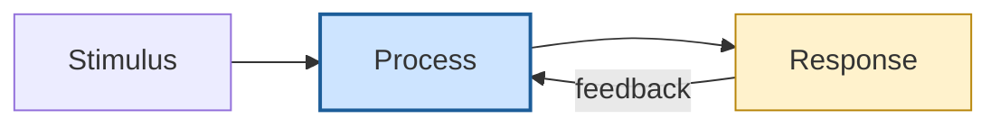
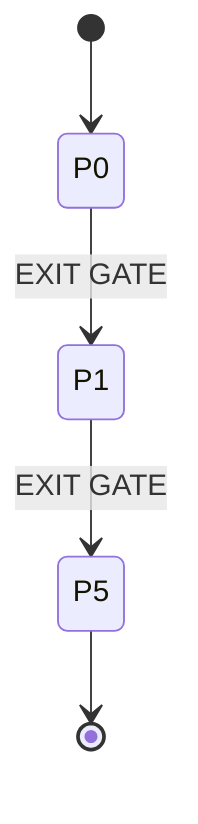
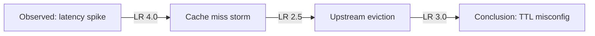
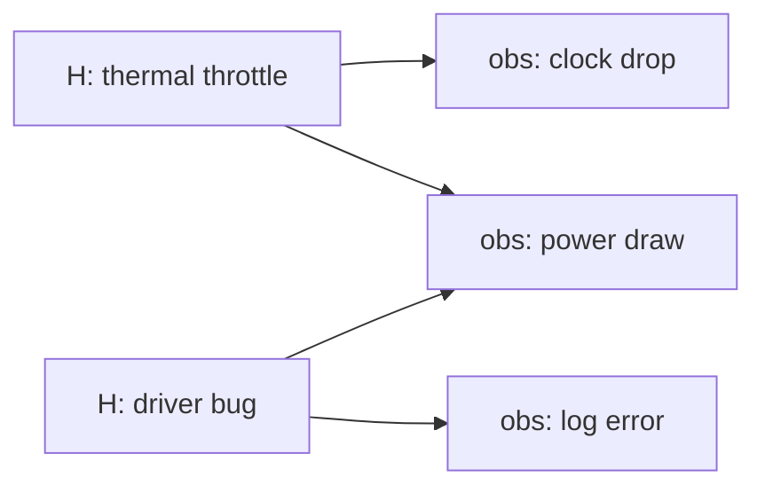

# Mermaid Diagram Conventions

> **Authority.** This document is the single source of truth for how the
> Epistemic Deconstructor represents dynamic systems, relationships, and
> processes as diagrams. Downstream reference docs and the
> `src/scripts/mermaid_render.py` emitter follow the rules stated here.

## Table of Contents

1. [Purpose & Scope](#1-purpose--scope)
2. [Policy: Default vs Exception](#2-policy-default-vs-exception)
3. [Diagram-Type-per-Structure Map](#3-diagram-type-per-structure-map)
4. [Styling & `classDef` Palette](#4-styling--classdef-palette)
5. [Accessibility](#5-accessibility)
6. [Determinism Rule (for Emitters)](#6-determinism-rule-for-emitters)
7. [Graceful Fallback Rule](#7-graceful-fallback-rule)
8. [Worked Examples](#8-worked-examples)
9. [Cross-References](#9-cross-references)

---

## 1. Purpose & Scope

Mermaid is the **default representation language** for dynamic systems,
relationships, and processes in this skill. Any structure that is naturally a
state machine, a graph of causes/relationships/dependencies, a flow or process,
a decision tree, an abductive inference chain, a stimulus-response or event
lifecycle, or a sub-agent dispatch topology SHOULD be expressed as a Mermaid
diagram unless it falls on the EXCEPTION list in §2. This document is the
authority that downstream reference docs and the `mermaid_render.py` emitter
follow; "default" is a preference governed by an explicit exception list, never
a mandate to convert every artifact.

---

## 2. Policy: Default vs Exception

| Category | Decision | Structures | Why |
|---|---|---|---|
| **DEFAULT — use Mermaid** | render as a diagram | state machines; causal / relationship / dependency graphs; flows & processes; decision trees; abductive inference chains; stimulus-response & event lifecycles; sub-agent dispatch topology | These are *topologies*: nodes + labeled edges. A diagram makes structure, direction, and reachability legible at a glance in a way prose and ASCII art cannot. |
| **EXCEPTION — keep current notation** | do NOT force a diagram | quantitative transfer-function / Laplace math | Mermaid has no math semantics; a node labeled `1/(s+a)` is a string, not an operator. Keep LaTeX / inline math. |
| **EXCEPTION** | keep current notation | dense numeric tables (archetype priors, validation thresholds, the File-Write Matrix) | A table is the superior lookup structure for value-by-key data; a diagram would scatter rows into nodes and lose the grid. |
| **EXCEPTION** | keep current notation | stock-and-flow System Dynamics with integrator semantics | Mermaid has no native stock / flow / rate notation. A flowchart silently drops the integrator (the `∫`), which is **information loss** — the model no longer says "this accumulates." Keep the SD equation form. |
| **EXCEPTION** | keep current notation | directory / file trees | The ASCII tree (`├──`, `│`) is clearer and more compact than a Mermaid `graph` for hierarchy-by-indentation. |

**Rule of thumb.** If the artifact's value is *which nodes connect to which, and
in what direction*, it is DEFAULT. If its value is *a number, an equation, an
accumulation, or an indented hierarchy*, it is an EXCEPTION.

---

## 3. Diagram-Type-per-Structure Map

| Structure | Mermaid type | Rationale |
|---|---|---|
| State machines (phase FSM, lifecycle automata) | `stateDiagram-v2` | First-class state + transition + initial/terminal markers. |
| Causal graphs | `flowchart` / `graph` | Directed signed edges (`+`/`-`) model influence. |
| Relationship / dependency graphs | `flowchart` / `graph` | Directed edges are the natural dependency representation. |
| Flows & processes | `flowchart` / `graph` | Sequential and branching steps map to nodes + arrows. |
| Decision trees | `flowchart` / `graph` | Branch labels on edges encode the decision predicate. |
| Abductive inference chains | `flowchart LR` | Linear premise → step → close, with per-step likelihood on edges. |
| Stimulus-response & event lifecycles | `sequenceDiagram` | Actor lifelines + ordered messages capture temporal call/response. |
| Bipartite coverage (candidate ↔ observation) | `graph LR` | Two ranked columns with cross-edges show what explains what. |
| Sub-agent dispatch topology | `flowchart` / `graph` | Orchestrator → agent fan-out is a directed graph. |

**Precedent.** The protocol FSM in `src/SKILL.md` (§ "FSM: Protocol State
Machine") is already authored as a `stateDiagram-v2`. New state machines MUST
match that style (initial `[*] -->`, transition labels after `:`, composite
`state "..." as x { ... }` blocks for tier subgraphs).

---

## 4. Styling & `classDef` Palette

Use a small, conventional palette so diagrams across the repo read the same.
Recommended classes:

| Class | Meaning | Suggested fill |
|---|---|---|
| `current` | the active / highlighted node | `#cde4ff` |
| `terminal` | a final / absorbing state | `#d7f5d7` |
| `adversarial` | an adversarial / attacker node | `#ffd6d6` |
| `reinforcing` | a reinforcing (R) feedback loop node | `#fff2cc` |
| `balancing` | a balancing (B) feedback loop node | `#e6e6fa` |

Example (valid, renderable):

Keep `classDef` declarations at the end of the diagram body, and apply them with
`class <id> <className>`. Do not invent ad-hoc colors per diagram; reuse this
palette.

---

## 5. Accessibility

- **Label nodes AND edges.** Every node carries a human-readable label; every
  edge that means something (a condition, a sign, a likelihood) carries an edge
  label. An unlabeled arrow is a dropped fact.
- **Never rely on color alone.** Color is decorative reinforcement, not the
  carrier of meaning. Pair every color with a text label or a distinct shape, so
  the diagram survives grayscale and color-blind rendering.
- **ASCII-sanitize node IDs.** Node *IDs* (the identifiers left of `["label"]`)
  MUST be ASCII alphanumerics / underscores. Unicode and operators belong in the
  quoted *label*, never in the ID.
- **Keep labels short.** Prefer a few words; push detail into surrounding prose.
  Long labels break layout and hurt the at-a-glance benefit that justified the
  diagram in the first place.

---

## 6. Determinism Rule (for Emitters)

`mermaid_render.py` — and any tool that emits Mermaid — MUST be **deterministic**:
the same input produces a **byte-identical** string every time, so snapshot tests
stay stable.

- **Stable, sanitized node IDs derived from content.** IDs are a pure function of
  the source data (e.g. a sanitized phase name), not of insertion order or object
  identity.
- **Sorted iteration order.** When iterating dicts/sets, sort by a stable key so
  edge and node order never depends on hash seeding.
- **No timestamps. No random. No PIDs.** Nothing time- or environment-dependent
  may appear in the output.

This section is the contract the `mermaid_render.py` emitter satisfies; its unit
tests assert byte-identical output across two calls on identical input.

---

## 7. Graceful Fallback Rule

If a structure is **not** in the DEFAULT set of §2 — because it is an explicit
EXCEPTION, or because it is ambiguous — keep its current notation. Do **not**
force a Mermaid diagram that loses information (the stock-and-flow integrator is
the canonical example: a flowchart silently drops the accumulator).

> **"Default" never means "convert everything."** When in doubt, leave the
> existing ASCII / table / equation in place and note why a diagram would lose
> information. A correct ASCII table beats a lossy diagram every time.

---

## 8. Worked Examples

**(a) Phase FSM (`stateDiagram-v2`).** A minimal tier FSM with a terminal state:

**(b) Abductive inference chain (`flowchart LR`) with edge labels.** Premise to
close, each edge carrying its per-step likelihood ratio:

**(c) Bipartite coverage (`graph LR`).** Candidates (left) explaining
observations (right):

---

## 9. Cross-References

- `system-identification.md` — structural model forms whose block topology is a
  DEFAULT graph; transfer-function math is an EXCEPTION (§2).
- `compositional-synthesis.md` — sub-model composition (fan-out / feedback)
  diagrams; the math of combination stays in equation form.
- `scope-interrogation.md` — scope / exogeneity relationship graphs.
- `abductive-reasoning.md` — inference chains and candidate↔observation coverage,
  the canonical sources for examples (b) and (c).
- `src/scripts/mermaid_render.py` — the deterministic emitter that satisfies §6
  and produces diagrams of these types from the project's existing data
  structures.
